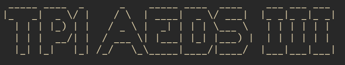
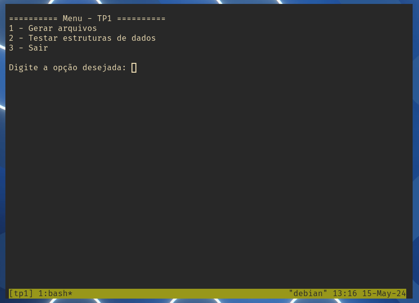

<div id="top"></div>

<!--Banner e logo-->
<h2 align="center" >
  
</h2>

<!--Short description-->
<h4 align="center">Análise do desempenho das estruturas e dados: Acesso sequencial, árvore binária e árvore binária balanceada (AVL).</h4>


<!--Sobre o projeto-->
## :computer: Sobre o projeto
O projeto requer a implementação de três estruturas de dados (sequencial, árvore binária e árvore binária balanceada) ou a utilização de bibliotecas que as ofereçam. Os registros da base de dados devem ser armazenados em arquivos de texto, cada linha contendo uma chave (int), dado1 (valor inteiro) e dado2 (string de até 1000 caracteres). O aluno é responsável por criar um gerador de dados aleatórios com essas características para preencher as estruturas de dados. O sistema lerá esses arquivos para preencher as estruturas.
<p align="right">(<a href="#top">back to top</a>)</p>

## :rocket: Como executar o projeto
Antes de começar, você vai precisar ter instalado em sua máquina as seguintes ferramentas: [Git](https://git-scm.com/) e [Python3](https://www.python.org/).


<!--Running session-->
### :package: Instalando
```bash
# Clone este repositório
$ git clone https://github.com/kaiquepy/tp1.git

# Acesse a pasta do projeto no terminal
$ cd tp1/
```

### ⚡ Rodando a aplicação [main.py](/src/main.py)
```bash
# Execute o arquivo principal
$ python3 main.py
```
<p align="right">(<a href="#top">back to top</a>)</p>

<!--Layout session-->
## :art: Aplicação
<h2 align="center" >
  
</h2>
<p align="right">(<a href="#top">back to top</a>)</p>


